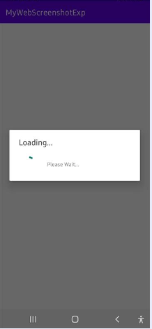
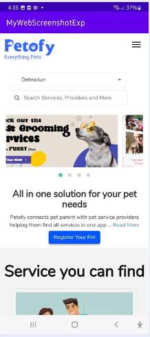
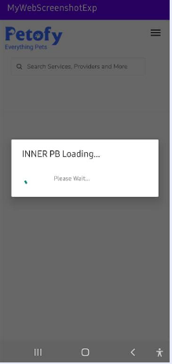

# WebView App

[](LICENSE)

## Description

A simple Android app that utilizes WebView to display web content within the app.

## Features

- Load and display web pages within the app using WebView.
- Handle web page navigation and page loading events.
- Customize WebView settings for JavaScript, caching, and other options.
- Handle cookies and manage session state with CookieManager.
- Support for showing progress indicators while loading web pages.
- Customizable UI and layout for the WebView activity.

## todo: 
- hiding a specific section of webPage

## Screenshots





## Installation

1. Clone the repository:
   ```bash
   git clone https://github.com/aman1sr/webView
   
2. Open the project in Android Studio.

3. Build and run the app on an Android device or emulator.

## Contributing
Contributions are welcome! If you find any issues or have suggestions for improvements, please feel free to open an issue or submit a pull request.